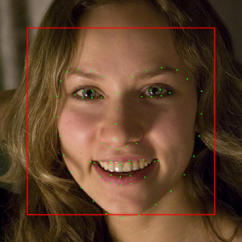
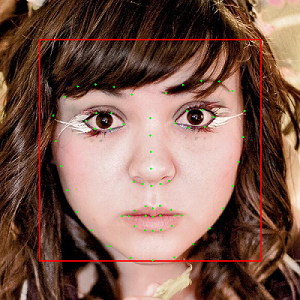
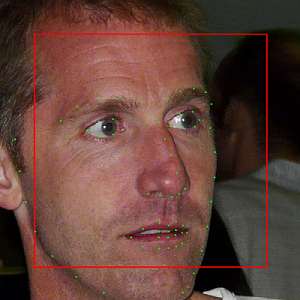
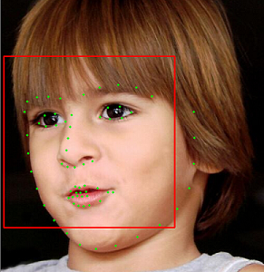

face-alignment-at-3000fps
=========================

C++ implementation of Face Alignment at 3000 FPS via Regressing Local Binary Features.

### Prepare Data

We can download dataset from [here][dataset]. The dataset contains 68 points for every face, however it doesn't provide a bounding box for faces. We need our face detector to generate face bounding box (I think it is resonable because we should ues the same face detector for training and prediction).

Download the dataset and extract the data (xxx.jpg and xxx.pts) to the directory `data`, e.g. `data/68`. We also need two text file `data/68/Path_Images_train.txt` and `data/68/Path_Images_test.txt` to list the images used for train and test. The path can be relative like `../data/68/xxx.jpg` or absolute like `/home/zhangjie/projects/face-alignment-at-3000fps/data/68/xxx.jpg` or `E:/projects/face-alignment-at-3000fps/data/68/xxx.jpg`.

### Build the project

We only need [OpenCV][opencv] and [CMake][cmake] to build the project.

```
$ git clone https://github.com/luoyetx/face-alignment-at-3000fps.git
$ cd face-alignment-at-3000fps
$ mkdir build && cd build
$ cmake ..
```

If you are on Linux, simply use `make` to compile the project. If you are on Windows, you may compile using [Visual Studio][vs].

### Train

Since we have prepare the data, `$ ./FaceAlignment prepare` will generate two text file `train.txt` and `test.txt` under `../data/68`. These text files are used for training and testing, each line points out an image path and face bounding box in this image with facial points location. We use VJ detector provided by OpenCV, you can use your own face detector to generate these two text file.

`$ ./FaceAlignment train` will start training and result will be lied in the directory `model`. `$ ./FaceAlignment test` will test the model on test data. If you have a Desktop Environment on the Linux, `$ ./FaceAlignment run` will do the prediction over test data by presenting a window to show the result.

### Tuning

The Configure is under `src/lbf/common.cpp/Config::Config`, modify the config under your own condition.

### Notice

The relative path used in source code are all start from `../build`, you may change this under your own condition.

### Pre-trained Model

I will not provide a pre-trained model, please train the code on your own data.

### Some Test






### License

BSD 3-Clause

### Reference

- [Datasets][dataset]
- [Face Alignment at 3000 FPS via Regressing Local Binary Features](http://research.microsoft.com/en-US/people/yichenw/cvpr14_facealignment.pdf)
- [jwyang/face-alignment](https://github.com/jwyang/face-alignment)
- [yulequan/face-alignment-in-3000fps](https://github.com/yulequan/face-alignment-in-3000fps)

[dataset]: http://ibug.doc.ic.ac.uk/resources/facial-point-annotations
[opencv]: http://opencv.org/
[cmake]: http://www.cmake.org/
[vs]: https://www.visualstudio.com/
